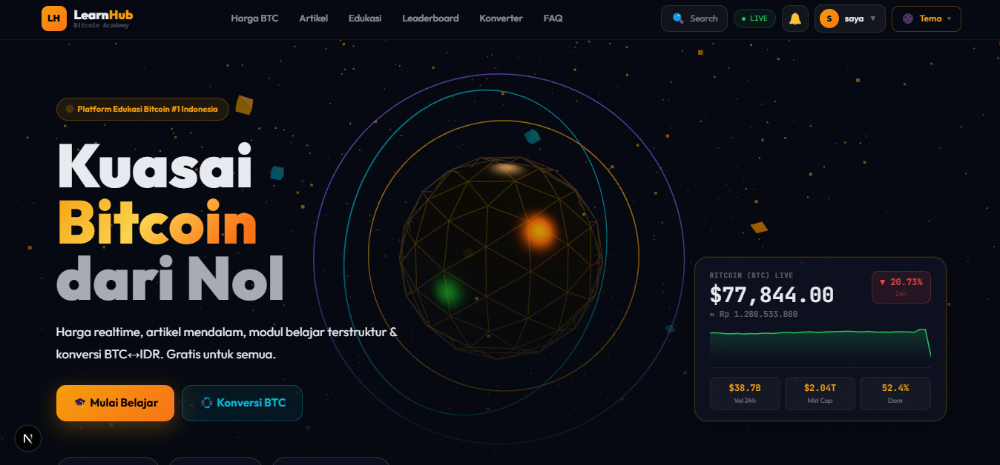
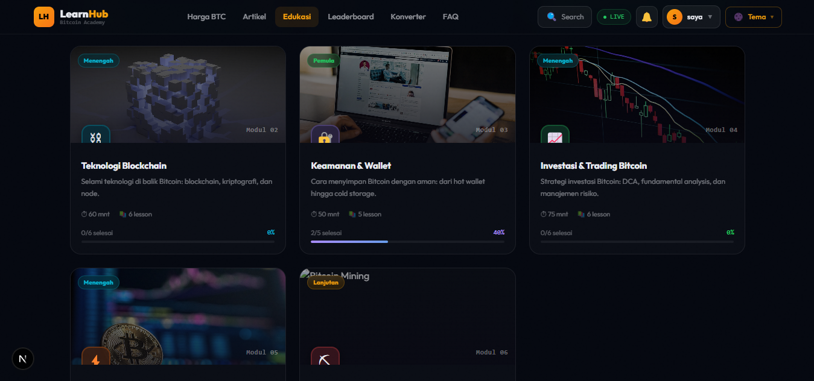
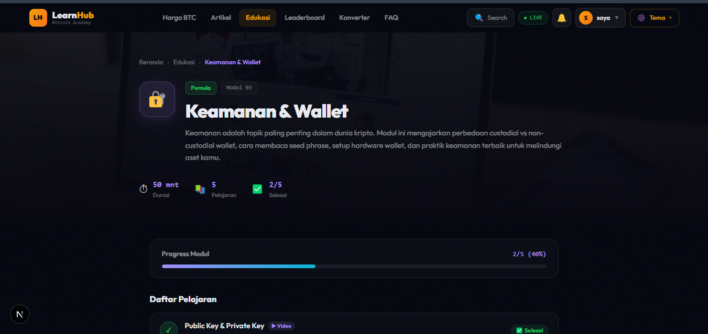
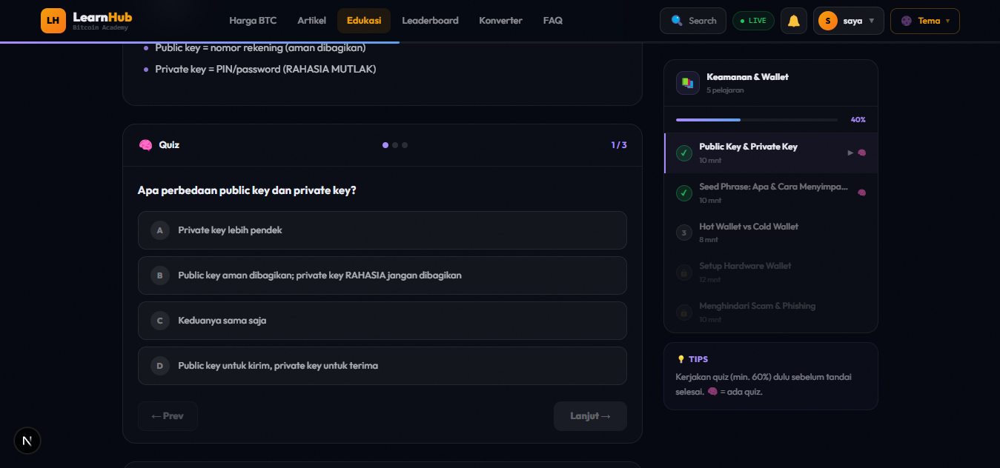
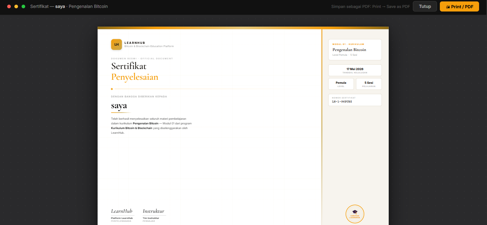
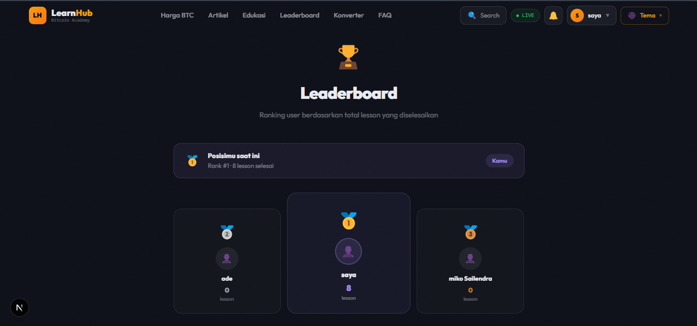
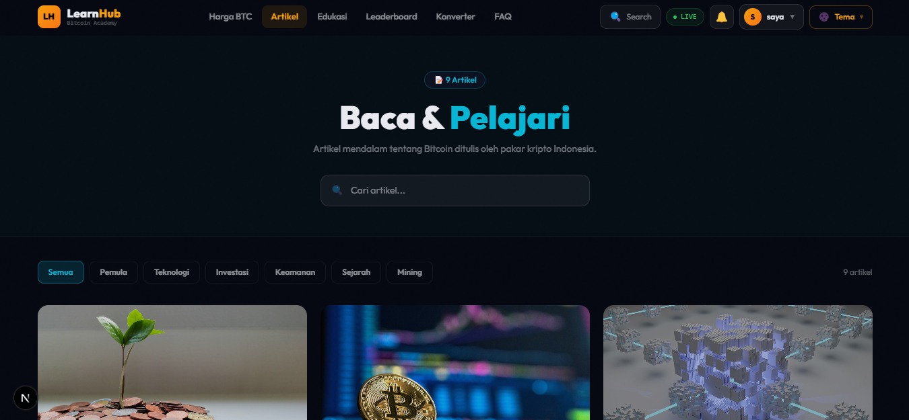
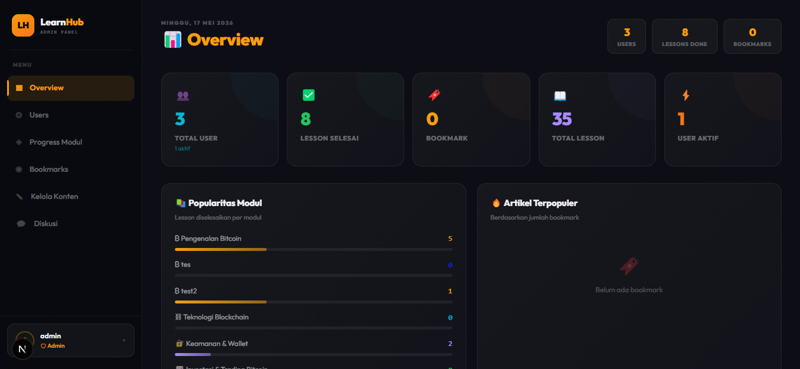

# LearnHub

A modern Bitcoin and Blockchain e-learning platform built with Next.js and Supabase. Features a complete learning management system with quizzes, certificates, discussion threads, leaderboard, notifications, and role-based access control.


## Screenshots


**Landing Page** - Bitcoin price ticker, featured modules, and latest articles on the homepage.


**Module List** - Browse all available learning modules with progress indicators and difficulty levels.


**Lesson Page** - Read or watch video lessons with a sidebar showing all lessons and your progress. Sequential lock ensures you complete lessons in order.


**Quiz** - Each lesson ends with a quiz. Questions are shuffled, scored, and you can retry as many times as you want. Results are saved to your profile.


**Certificate** - Complete all lessons in a module to unlock a print-ready PDF certificate with a unique certificate number.


**Leaderboard** - Rankings based on total lessons completed. Only visible to logged-in users. Admin and superadmin accounts are excluded.


**Article Reader** - Clean reading experience with rich markdown rendering, bookmark support, estimated read time, and related articles.


**Admin Dashboard** - Manage modules, lessons, quizzes, articles, discussions, and users all in one place.


## Features

### Learning
- Video, text, and markdown lessons
- Quiz per lesson with shuffle, scoring, and retry
- Sequential lesson lock (complete in order)
- Progress tracking per user per module
- Print-ready PDF certificates on module completion
- Share certificate to WhatsApp, X, and LinkedIn

### Community
- Discussion threads per lesson with nested replies (max 1 indent level)
- Comment rate limiting (30 second cooldown)
- Real-time notification bell with unread badge
- Full notification page with filters and delete

### Gamification
- Leaderboard ranked by lessons completed (login only)
- Learning streak tracking (daily activity)
- Admin and superadmin excluded from leaderboard

### Content
- Article system with rich markdown rendering
- Bookmark articles
- Infinite scroll on article list and discussions
- Global search across lessons and articles
- Preview blurred content for locked lessons

### Auth and Roles
- Email and password auth
- Google OAuth (one click setup)
- Three roles: `user`, `admin`, `superadmin`
- Row Level Security on all tables

### Admin Panel
- CRUD for modules, lessons, quizzes, and articles
- Discussion moderation with link to source lesson
- User management (superadmin only)
- Send notifications to all users on new content


## Tech Stack

| Layer | Tech |
|---|---|
| Framework | Next.js 16 (App Router, Turbopack) |
| Language | TypeScript |
| Styling | Tailwind CSS v4 + inline styles |
| Backend | Supabase (Postgres, Auth, RLS) |
| Auth | Supabase Auth + Google OAuth |
| Deployment | Vercel (recommended) |


## Getting Started

### Prerequisites

- Node.js 18+
- A [Supabase](https://supabase.com) project
- (Optional) Google Cloud project for Google OAuth

### 1. Clone the repo

```bash
git clone https://github.com/yourusername/learnhub.git
cd learnhub
```

### 2. Install dependencies

```bash
npm install
```

### 3. Set up environment variables

Create a `.env.local` file in the root:

```env
NEXT_PUBLIC_SUPABASE_URL=https://your-project-ref.supabase.co
NEXT_PUBLIC_SUPABASE_ANON_KEY=your-anon-key
```

Get these from your Supabase dashboard under **Settings > API**.

### 4. Set up the database

Run the SQL files in order in your Supabase SQL Editor:

```
1_schema.sql
2_seed.sql
3_update_lessons.sql
4_seed_lesson_content.sql
5_schema_quiz.sql
6_seed_quiz.sql
7_update_modules_and_quiz_results.sql
8_add_module_banner.sql
9_schema_discussions.sql
10_schema_notifications_leaderboard.sql
11_fix_notifications_rls_and_streak.sql
```

### 5. Run the development server

```bash
npm run dev
```

Open [http://localhost:3000](http://localhost:3000).


## Google OAuth Setup

1. Go to [Google Cloud Console](https://console.cloud.google.com)
2. Create or select a project
3. Go to **APIs and Services > Credentials > Create Credentials > OAuth 2.0 Client ID**
4. Application type: **Web application**
5. Add this to **Authorized redirect URIs**:
   ```
   https://your-project-ref.supabase.co/auth/v1/callback
   ```
6. Copy the **Client ID** and **Client Secret**
7. In Supabase dashboard: **Authentication > Sign In / Sign Up > Google**
8. Paste Client ID and Client Secret, then save


## Project Structure

```
app/
  page.tsx              # Landing page
  layout.tsx            # Root layout
  not-found.tsx         # Custom 404
  login/                # Login page
  register/             # Register page
  akun/                 # User profile and progress
  edukasi/              # Module list
  edukasi/[id]/         # Module detail + certificate
  edukasi/[id]/lesson/[lessonId]/  # Lesson + quiz + discussion
  artikel/              # Article list (infinite scroll)
  artikel/[id]/         # Article detail with markdown renderer
  leaderboard/          # Ranking (login required)
  notifikasi/           # Full notification page
  admin/                # Admin dashboard
  superadmin/           # Superadmin panel
  components/           # Shared components
    Navbar.tsx
    NotificationBell.tsx
    DiscussionSection.tsx
    GlobalSearch.tsx
    ...
  context/
    AuthContext.tsx      # User session and role
  lib/
    supabase.ts          # Supabase client
    supabase-data.ts     # Data fetching helpers
```


## Roles

| Role | Access |
|---|---|
| `user` | All learning features, profile, bookmarks, discussions |
| `admin` | All user access + admin dashboard (CRUD content, moderation) |
| `superadmin` | All admin access + user management, role assignment |

Set a user's role by updating the `role` column in the `profiles` table via Supabase dashboard or the superadmin panel.


## Database Schema

Key tables:

| Table | Description |
|---|---|
| `profiles` | User profile, avatar, role, bio |
| `modules` | Learning modules |
| `module_lessons` | Lessons inside each module |
| `module_progress` | User progress per lesson |
| `quiz_questions` | Quiz questions per lesson |
| `quiz_results` | User quiz scores and attempts |
| `lesson_discussions` | Discussion comments and replies |
| `articles` | Blog and educational articles |
| `artikel_bookmarks` | User bookmarks |
| `notifications` | Per-user notifications |
| `learning_streaks` | Daily learning streak per user |

Views:

| View | Description |
|---|---|
| `leaderboard` | Ranked users by lessons completed (excludes admin roles) |


## Deployment

### Vercel (recommended)

1. Push to GitHub
2. Import project at [vercel.com](https://vercel.com)
3. Add environment variables:
   - `NEXT_PUBLIC_SUPABASE_URL`
   - `NEXT_PUBLIC_SUPABASE_ANON_KEY`
4. Deploy

### Supabase

No additional config needed. Make sure your Supabase project's **Site URL** is set to your production URL under **Authentication > URL Configuration**.


## License

MIT
